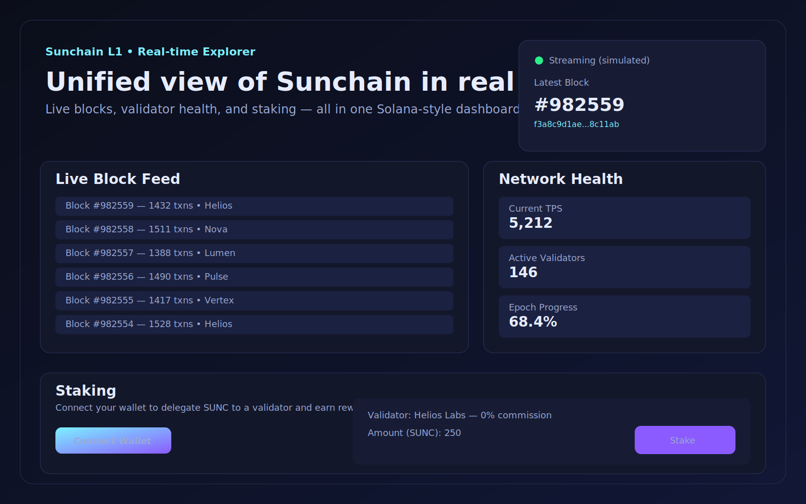

# Sunchain

Sunchain is a lightweight Go-based proof-of-history + proof-of-stake inspired L1 node, paired with a static explorer UI that showcases live block feeds, validator health, and staking UX. The node exposes a JSON-RPC API, gossips peer lists over TCP, persists chain progress locally, and streams produced blocks over WebSocket for low-latency dashboards and integrations. The explorer UI renders a Solana-style dashboard and can fall back to simulated metrics when a stream is unavailable.

## Features

- **Proof of History (PoH) tick generator** to create deterministic hashes and sequences.
- **Proof of Stake (PoS) validator selection** weighted by stake.
- **Block production loop** with configurable intervals.
- **TCP gossip** for peer discovery and heartbeats.
- **JSON-RPC server** for health, validator, and latest block queries.
- **WebSocket block stream (`/blocks`)** for real-time consumers and dashboards.
- **Atomic local persistence** of chain head (`data/chain-state.json`) for restart recovery.
- **HTTP hardening defaults** (request size limits, strict JSON decoding, server timeouts).
- **Static explorer UI** for live block feeds, validator health, and staking interactions.

## Repository layout

```
cmd/sunchain/        # Node entrypoint
internal/config/     # Configuration defaults
internal/consensus/  # PoH + PoS logic
internal/gossip/     # TCP gossip networking
internal/node/       # Node orchestration + RPC handler
internal/rpc/        # JSON-RPC server
internal/types/      # Shared types
index.html           # Explorer UI
script.js            # Explorer UI logic
style.css            # Explorer UI styles
```

## Getting started

### Prerequisites

- Go 1.21+

### Run a node

```bash
go run ./cmd/sunchain
```

### Configuration flags

| Flag | Default | Description |
| --- | --- | --- |
| `-node-id` | `node-1` | Unique node identifier |
| `-rpc-addr` | `0.0.0.0:8080` | JSON-RPC listen address |
| `-gossip-addr` | `0.0.0.0:9000` | TCP gossip listen address |
| `-block-interval` | `400ms` | Block production interval |
| `-data-dir` | `./data` | Directory for persisted chain state |
| `-allowed-origin` | `*` | Allowed `Origin` header for `/blocks` WebSocket |

Example:

```bash
go run ./cmd/sunchain -node-id validator-1 -rpc-addr 0.0.0.0:8081 -gossip-addr 0.0.0.0:9100 -block-interval 600ms
```

## JSON-RPC API

The node exposes a JSON-RPC 2.0 endpoint at `POST /rpc`.

### Health

```bash
curl -s http://localhost:8080/rpc \
  -H 'Content-Type: application/json' \
  -d '{"jsonrpc":"2.0","method":"getHealth","id":1}'
```

### Validators

```bash
curl -s http://localhost:8080/rpc \
  -H 'Content-Type: application/json' \
  -d '{"jsonrpc":"2.0","method":"getValidators","id":2}'
```

### Latest block

```bash
curl -s http://localhost:8080/rpc \
  -H 'Content-Type: application/json' \
  -d '{"jsonrpc":"2.0","method":"getLatestBlock","id":3}'
```

## Gossip protocol

- Peers connect over TCP to the configured `-gossip-addr`.
- Messages are JSON-encoded with `peer_list` and `heartbeat` types.
- The node gossips discovered peers to new connections.

## Explorer UI

Open `index.html` in a browser. The UI connects to a WebSocket at `ws://localhost:8080/blocks` if available; when the connection fails, it falls back to a simulated block stream and synthetic metrics so the dashboard is always active. The staking panel is a front-end mock to demonstrate user flows.

### Dashboard preview

Use `dashboard-preview.svg` for quick docs, presentations, or status updates when sharing the current Sunchain explorer look and feel. SVG keeps the preview diff-friendly in PRs where binary files are not supported.




## Production deployment baseline

### Operational efficiency and speed

- Keep `-block-interval` aligned with CPU budget and target throughput; lower intervals increase producer and gossip load.
- Run the node behind a reverse proxy (NGINX/Envoy/Caddy) with keep-alive and compression tuned for your traffic profile.
- Place `-data-dir` on low-latency persistent SSD volumes and monitor write latency for state-file updates.
- Use process supervision (`systemd`, Kubernetes Deployments, Nomad) with restart policies and resource limits.

### Security hardening

- Set `-allowed-origin` to your explorer/app origin in production (avoid `*` on public deployments).
- Restrict RPC exposure with network policy/firewalls; only expose ports needed by clients and peers.
- Terminate TLS at the edge proxy and enforce HTTPS/WSS for all external traffic.
- Run the binary as a non-root user with least-privilege filesystem access to `-data-dir`.

### Scalability and reliability

- Scale read traffic horizontally by running multiple node instances behind a load balancer for `/rpc` and `/blocks`.
- Use separate private networking for gossip traffic to reduce noisy-neighbor effects.
- Externalize metrics/log shipping (Prometheus/OpenTelemetry + centralized logs) for SLO tracking and autoscaling signals.
- Keep persistent volumes across restarts to preserve latest chain head and reduce recovery time.

## Containerized deployment example

```dockerfile
FROM golang:1.21 AS builder
WORKDIR /src
COPY . .
RUN CGO_ENABLED=0 GOOS=linux GOARCH=amd64 go build -o /out/sunchain ./cmd/sunchain

FROM gcr.io/distroless/static-debian12
WORKDIR /app
COPY --from=builder /out/sunchain /app/sunchain
USER nonroot:nonroot
EXPOSE 8080 9000
ENTRYPOINT ["/app/sunchain"]
```

Run with a mounted persistent volume:

```bash
docker run --rm -p 8080:8080 -p 9000:9000 \
  -v $(pwd)/data:/app/data \
  sunchain:latest \
  -rpc-addr 0.0.0.0:8080 -gossip-addr 0.0.0.0:9000 -data-dir /app/data
```

